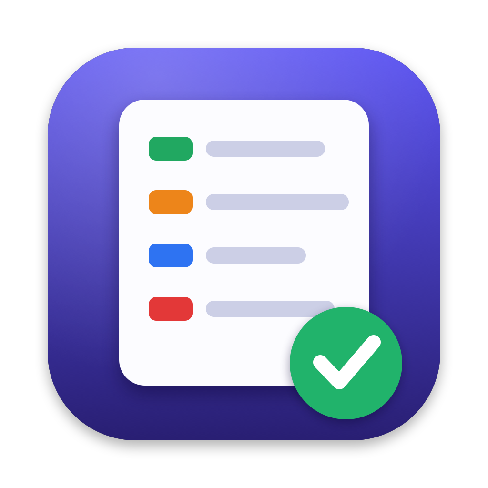
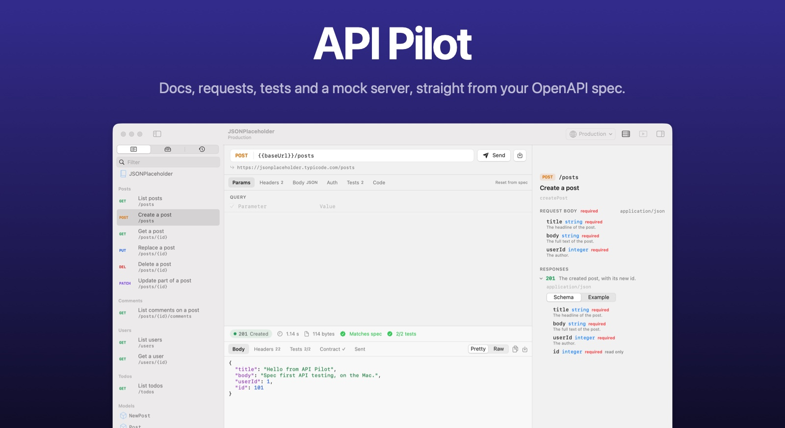

<p align="center">
  
</p>

<h1 align="center">API Pilot</h1>

<p align="center">
  Your OpenAPI spec as docs, a request client, tests and a mock server, in one native Mac app.
  <br>
  Free and open source. For macOS 14 and later.
  <br>
  <a href="../../releases/latest">Download&nbsp;&rsaquo;</a>
  &nbsp;&nbsp;
  <a href="#build-from-source">Build from source&nbsp;&rsaquo;</a>
</p>

<p align="center">
  
</p>

<br>

## Why API Pilot

Swagger UI shows you an API. Postman lets you call it. Most teams keep both open, and the two drift apart.
API Pilot starts from the spec and builds everything else from it, so the docs, the requests and the tests always describe the same API.

## What it does

**Docs.** Open an OpenAPI 3.0, 3.1 or Swagger 2.0 file in YAML or JSON. Endpoints are grouped by tag in the sidebar, and every endpoint has its parameters, request body and responses documented beside the request, with schemas you can expand and generated examples.

**Requests.** Selecting an endpoint builds a ready request from the spec: path and query parameters, headers, an example body and the right authentication. Edit anything and press ⌘↩ to send. Responses are shown with syntax highlighting, headers, timing and size, and code for cURL, HTTPie, JavaScript, Python, Swift and Go is one tab away.

**Contract checks.** Every response is validated against the schema the spec documents for that status code. Missing fields, wrong types, bad formats and values outside the allowed range are listed with their exact JSON path.

**Tests.** Each request comes with assertions taken from the spec, such as the expected status and a schema match. Add your own on status, JSON values, headers, body text or response time, and save values from a response, such as a login token, into the environment for the next request. The collection runner (⇧⌘R) runs every saved request in order.

**Mock server.** One switch serves the whole spec on `http://127.0.0.1:4010` with documented examples. Request bodies are validated, and a `Prefer: code=404` header returns any other documented response.

**Environments.** Variables such as `{{baseUrl}}` and `{{token}}` are filled from the active environment. Environments are created from the servers in the spec, and values marked secret are kept in the Keychain.

**Files you can commit.** Saved requests and environments are plain JSON in a `.apipilot` folder next to the spec, so they live in git with the code. Secret values never reach those files. Edit the spec in any editor and API Pilot reloads it as soon as you save.

**HTML export.** Export a single file API reference with navigation, tables and examples, in light and dark.

## Workspace layout

```
your-api/
├── openapi.yaml
└── .apipilot/
    ├── environments/
    │   └── production.json
    └── requests/
        └── create-a-post.json
```

## Keyboard

| Shortcut | Action |
| --- | --- |
| ⌘O | Open a spec |
| ⌘↩ | Send |
| ⌘S | Save the request |
| ⌘E | Environments |
| ⌘R | Reload the spec |
| ⇧⌘R | Run the collection |
| ⇧⌘M | Start or stop the mock server |
| ⌘F | Find in a response |

## Install

Download `APIPilot.dmg` from the [latest release](../../releases/latest) and drag API Pilot to Applications.
The build is not notarised, so the first time you open it, right click the app and choose Open.

## Build from source

API Pilot is a Swift package with no Xcode project. You need Xcode 16 or later.

```sh
swift run APIPilot                # run a debug build
swift test                        # run the tests
scripts/build-app.sh              # build build/API Pilot.app
scripts/build-app.sh --dmg        # also build build/APIPilot.dmg
```

The build is signed ad hoc. Set `SIGN_IDENTITY` to sign with your own certificate.

## Not yet supported

References to other files (`$ref: ./schemas/pet.yaml`), OAuth 2.0 flows other than client credentials, WebSocket and GraphQL requests, and importing Postman collections.

## Licence

MIT
